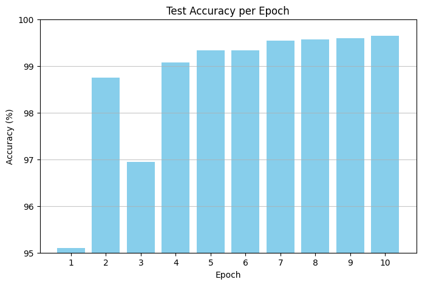

# MNIST Classification Model

## **Summary**
This project implements a Convolutional Neural Network (CNN) for MNIST digit classification using PyTorch, achieving **99.64%** test accuracy in just 10 epochs through optimized architecture, data augmentation, and learning rate scheduling.

### **Key Metrics**
- **🔗 Google Colab URL**: [Google colab URL](https://colab.research.google.com/drive/13p46r4dpF13sd4aO73xNAa7myDSlG95X#scrollTo=I5JMTYwnRlo3)
- **📊 Number of Parameters**: **9,594**
- **🎯 Final Test Accuracy**: **99.64%**
- **⏱️ Training Epochs**: **10**

## **Model Performance Visualization**


## **Architecture**

The model uses a lightweight CNN architecture with three convolutional blocks designed for efficient feature extraction:

### **Block 1 (Feature Detection)**
```
Input: 28×28×1 (grayscale MNIST image)
├── Conv2d(1→8, kernel=3×3) → BatchNorm → ReLU → 26×26×8
├── Conv2d(8→16, kernel=3×3) → BatchNorm → ReLU → 24×24×16
└── MaxPool2d(2×2) → 12×12×16
```

### **Block 2 (Feature Refinement)**
```
Input: 12×12×16
├── Conv2d(16→16, kernel=3×3) → BatchNorm → ReLU → 10×10×16
├── Conv2d(16→16, kernel=3×3) → BatchNorm → ReLU → 8×8×16
└── MaxPool2d(2×2) → 4×4×16
```

### **Block 3 (High-level Features)**
```
Input: 4×4×16
├── Conv2d(16→16, kernel=3×3) → BatchNorm → ReLU → 2×2×16
└── Conv2d(16→16, kernel=2×2) → BatchNorm → ReLU → 1×1×16
```

### **Classification Head**
```
Input: 1×1×16 (flattened to 16)
├── Linear(16→10)
└── LogSoftmax → 10 class probabilities
```

### **Architecture Highlights**
- **Parameter Efficiency**: Only 9,594 parameters through strategic channel sizing
- **Regularization**: Batch normalization after each conv layer 
- **Activation**: ReLU throughout for computational efficiency

## **Data Augmentation**
Training data augmentation includes:
- **Random Rotation**: ±15 degrees to handle rotated digits
- **Random Translation**: ±2 pixels in both directions for positional invariance
- **Normalization**: Mean=0.1307, Std=0.3081 (MNIST dataset statistics)

Test data uses only normalization (no augmentation for consistent evaluation).

## **Learning Rate Schedule**
**OneCycleLR Scheduler** with Adagrad optimizer:
- **Base LR**: 0.1 (starting and ending learning rate)
- **Max LR**: 0.75 (peak learning rate at 30% of training)
- **Div Factor**: 7.5 (base_lr = max_lr / div_factor)
- **Strategy**: Cosine annealing for smooth transitions
- **Warmup**: 30% of total steps for gradual ramp-up
- **Momentum Cycling**: Disabled for Adagrad compatibility
- **Steps per Epoch**: Scheduler updates after each batch (not epoch)

## **Training Results**

```
Starting training...

Epoch 1/10
Training: 100%|██████████| 469/469 [01:26<00:00,  5.44it/s]
Testing: 100%|██████████| 79/79 [00:03<00:00, 23.17it/s]
Train Loss: 0.2262, Train Acc: 92.94%
Test Loss: 0.1426, Test Acc: 95.10%
Learning Rate: 0.100000

Epoch 2/10
Training: 100%|██████████| 469/469 [01:27<00:00,  5.38it/s]
Testing: 100%|██████████| 79/79 [00:03<00:00, 20.31it/s]
Train Loss: 0.1042, Train Acc: 96.76%
Test Loss: 0.0406, Test Acc: 98.75%
Learning Rate: 0.262710

Epoch 3/10
Training: 100%|██████████| 469/469 [01:26<00:00,  5.44it/s]
Testing: 100%|██████████| 79/79 [00:04<00:00, 16.33it/s]
Train Loss: 0.0856, Train Acc: 97.33%
Test Loss: 0.0900, Test Acc: 96.94%
Learning Rate: 0.587919

Epoch 4/10
Training: 100%|██████████| 469/469 [01:25<00:00,  5.46it/s]
Testing: 100%|██████████| 79/79 [00:03<00:00, 23.24it/s]
Train Loss: 0.0688, Train Acc: 97.87%
Test Loss: 0.0272, Test Acc: 99.08%
Learning Rate: 0.750000

Epoch 5/10
Training: 100%|██████████| 469/469 [01:26<00:00,  5.42it/s]
Testing: 100%|██████████| 79/79 [00:03<00:00, 22.96it/s]
Train Loss: 0.0562, Train Acc: 98.24%
Test Loss: 0.0201, Test Acc: 99.33%
Learning Rate: 0.713370

Epoch 6/10
Training: 100%|██████████| 469/469 [01:26<00:00,  5.40it/s]
Testing: 100%|██████████| 79/79 [00:03<00:00, 23.00it/s]
Train Loss: 0.0502, Train Acc: 98.46%
Test Loss: 0.0227, Test Acc: 99.34%
Learning Rate: 0.611043

Epoch 7/10
Training: 100%|██████████| 469/469 [01:25<00:00,  5.50it/s]
Testing: 100%|██████████| 79/79 [00:04<00:00, 16.49it/s]
Train Loss: 0.0410, Train Acc: 98.71%
Test Loss: 0.0168, Test Acc: 99.54%
Learning Rate: 0.463285

Epoch 8/10
Training: 100%|██████████| 469/469 [01:25<00:00,  5.50it/s]
Testing: 100%|██████████| 79/79 [00:03<00:00, 22.69it/s]
Train Loss: 0.0368, Train Acc: 98.89%
Test Loss: 0.0138, Test Acc: 99.57%
Learning Rate: 0.299361

Epoch 9/10
Training: 100%|██████████| 469/469 [01:26<00:00,  5.42it/s]
Testing: 100%|██████████| 79/79 [00:03<00:00, 22.69it/s]
Train Loss: 0.0350, Train Acc: 98.88%
Test Loss: 0.0139, Test Acc: 99.60%
Learning Rate: 0.151739

Epoch 10/10
Training: 100%|██████████| 469/469 [01:26<00:00,  5.41it/s]
Testing: 100%|██████████| 79/79 [00:04<00:00, 19.66it/s]
Train Loss: 0.0317, Train Acc: 98.99%
Test Loss: 0.0133, Test Acc: 99.64%
Learning Rate: 0.049657
Training completed!

============================================================
TRAINING METRICS SUMMARY
============================================================
 Epoch  Train_Loss  Test_Loss  Train_Accuracy  Test_Accuracy  Learning_Rate
     1    0.226233   0.142617       92.945000          95.10       0.100000
     2    0.104231   0.040621       96.763333          98.75       0.262710
     3    0.085595   0.090042       97.328333          96.94       0.587919
     4    0.068835   0.027186       97.870000          99.08       0.750000
     5    0.056203   0.020096       98.240000          99.33       0.713370
     6    0.050192   0.022699       98.458333          99.34       0.611043
     7    0.040985   0.016753       98.713333          99.54       0.463285
     8    0.036785   0.013820       98.888333          99.57       0.299361
     9    0.035031   0.013867       98.880000          99.60       0.151739
    10    0.031684   0.013318       98.993333          99.64       0.049657
============================================================
```


*Training curves and sample predictions will be generated when running the model*
